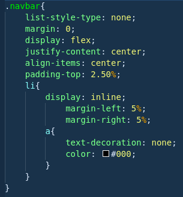

Sass Becode
===========

## How to install SASS ?

He have many different installation :

    Standalone -> Just download the [file](https://github.com/sass/dart-sass/releases) in Github and move the file in your repository/Folder
    NodeJS -> npm install -g sass
    Chocolatey -> choco install sass
    brew -> brew install sass/sass/sass

## What is Sass ?

Sass is an Extension and Pre processor for CSS3
Sass use .scss & .sass

## How he does work ? (Pre Processor)
Sass need a input file (SASS SCSS)
Sass compile then the file in CSS

_.scss .sass can't be read by browser._

## Why use SASS ?
    **Free**
    **Easy To learn (2 Syntax)**
    **Win Time and Organisation**

## SASS VS SCSS

 
