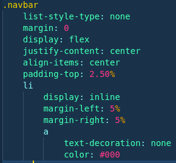

Sass Becode
===========

## How to install SASS ?

He have many different installation :

    Standalone -> Just download the file in Github and move the file in your repository/Folder
    NodeJS -> npm install -g sass
    Chocolatey -> choco install sass
    brew -> brew install sass/sass/sass

[FileStandalone](https://github.com/sass/dart-sass/releases)
## What is Sass ?

Sass is an Extension and Pre processor for CSS3
Sass use .scss & .sass

## How he does work ? (Pre Processor)
Sass need a input file (SASS SCSS)
Sass compile then the file in CSS

_.scss .sass can't be read by browser._

## Why use SASS ?
    **Free**
    **Easy To learn (2 Syntax)**
    **Win Time and Organisation**

## How you can setup SASS :
The first part is the target SASS file (Compiler)
The Second Part is your scss file
and the third part is for the output file

./foldername/sass ./foldername/style.scss output.css 

_You can write ' --watch ' after the command if you not like save with the command all time!_

## SASS VS SCSS

 

_Same code but the difference between is .SASS doesn't have symbole. (Just :) -> {};_

## SASS&SCSS VS CSS 

You can see the .SCSS with one block, and the CSS with tree block. It saves us copy paste all time and win organisation.

 

## Variable

Yep, in SASS, we can use Variable for text or value

On this example, i give to my variable responsive : screen with max-width: #{$normal}...

_Results :_
_Left SCSS - RIGHT CSS_

## @Import

You can import another file in your style.scss(Example)
    @import 'examplefile.scss';

## @Mixin

Imagine, you need to give many code for many class, id, (More)...

You can include @mixin in your code and give the same code for class, id, (More) with @include.

Example : 

    @mixin button{
        &:hover{
            color: red;
        }
    }

    a{
        text-decoration: none;
        color: #example;
        @include button()
    }

    .text{
        @include button()
    }

The output :

    a{
        text-decoration: none;
        color: #example;
    }

    a:hover{
        color:red;
    }

    .text:hover{
        color: red;
    }

## @Extend

Okay, so, now image you need the SAME code than another class but take a Mixin for 2 class is not creative & productive :

You can use @extend

    .navbar{
        list-style-type: none;
        margin: 0;
        display: flex;
        justify-content: center;
        align-items: center;
        padding-top: 2.50%;
        li{
            display: inline;
            margin-left: 5%;
            margin-right: 5%;
            a{
                text-decoration: none;
                color: #000;
                @include button()
            }
        }
    }

    .navbar-sass{
        @extend .navbar
    }

The output :

    .navbar, .navbar-sass{
        list-style-type: none;
        margin: 0;
        display: flex;
        justify-content: center;
        align-items: center;
        padding-top: 2.50%;
    }

    .navbar, .navbar-sass li{
        display: inline;
        margin-left: 5%;
        margin-right: 5%;
    }

    .navbar, .navbar-sass li a{
        text-decoration: none;
        color: #000;
        @include button()
    }

## @if & @Else

Simple If & Else exist in SASS

Just a example :

    .btn {
        text-decoration: none;
        background: $primary;
    @if (lightness($primary) > 50%) {
        color: #000;
    } @else {
        color: #FFF;
    }
}

## @Each

Here, i give a example with 2 value, but you can do with more value or a simple value :
    
    nth($variable, 1)

nth give the value of the variable and the number, here: 1 give you the value

He take the nth:1 so he take the list "btn"
And he return the nth:2 so he return the color for the nth:1

## @for (Loop)

Here, i give you an example for the opacity, but you can do something else

for $variable from number/variable through number/variable {
    Do a Action
} 

## It's over

After 1 hour ! I finished this README.md ! Thanks if you read my "Tutorial"

[My Github](https://github.com/LunashaGit)